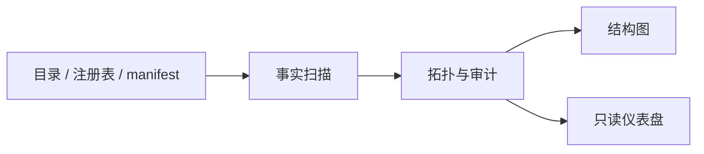

# Agent System Cartographer

我想知道一个 Agent 系统到底由什么组成：文件放在哪里，Skill 从哪里来，哪些东西真的启用了，哪些关系只是写在说明里，哪些路径已经失效。

这件事比画一张好看的架构图难。真正的难点，是分清“声明过”“文件存在”和“运行时正在使用”这三件事。

这个项目刚刚开始。目前它适合检查两头乌这一类以 Skill、注册表和 Agent manifest 组织的本地系统，还不能证明自己适用于所有 Agent 框架。我先把它公开，是因为这里的问题和失败边界本身也值得展示。

## 三个部分

- `system-cartographer`：读取目录、注册表和 manifest，生成可复现的拓扑与审计结果；
- `structure-diagrammer`：把一个 Skill、Agent 或项目目录转成 Markdown、Mermaid 和 SVG；
- `skills-dashboard`：把 Skill、Capability 和运行时关系放进一个只读的本地网页。

它们组成一条简单的证据链：



## 现在可以做什么

```bash
# 扫描仓库附带的最小样例
ruby skills/system-cartographer/scripts/update_topology.rb \
  --root examples/minimal-agent-system --strict

# 为一个 Skill 生成结构说明、Mermaid、SVG 和 Archscribe spec
python3 skills/structure-diagrammer/scripts/diagram_structure.py \
  --input skills/system-cartographer \
  --output /tmp/cartographer-diagram \
  --basename system-cartographer

# 在两头乌式注册表项目中启动只读仪表盘
capabilities/skills-dashboard/adapters/skills-dashboard start --open
```

扫描器不会读取凭据、对话正文、模型数据、缓存和 Git 历史。实线关系来自明确的文件或注册字段；虚线关系只是文本匹配得到的推测，不能当成真实调用关系。

## 当前限制

- 注册表结构仍然偏向两头乌，还没有做成通用标准；
- 目录扫描和声明审计已经有确定性输出，但跨框架测试很少；
- 仪表盘的 `inferred_uses` 只能提示线索，不能证明依赖；
- 目前主要在 macOS 和我自己的项目结构中使用；
- 这个版本没有经过严格的兼容性验证，接口仍可能变化。

如果它报出 `unknown`，意思就是证据不够。我不希望它为了让图更完整而编造关系。

## 验证

```bash
capabilities/skills-dashboard/tests/test_skills_dashboard.sh
ruby skills/system-cartographer/scripts/update_topology.rb \
  --root examples/minimal-agent-system --strict
```

MIT License
